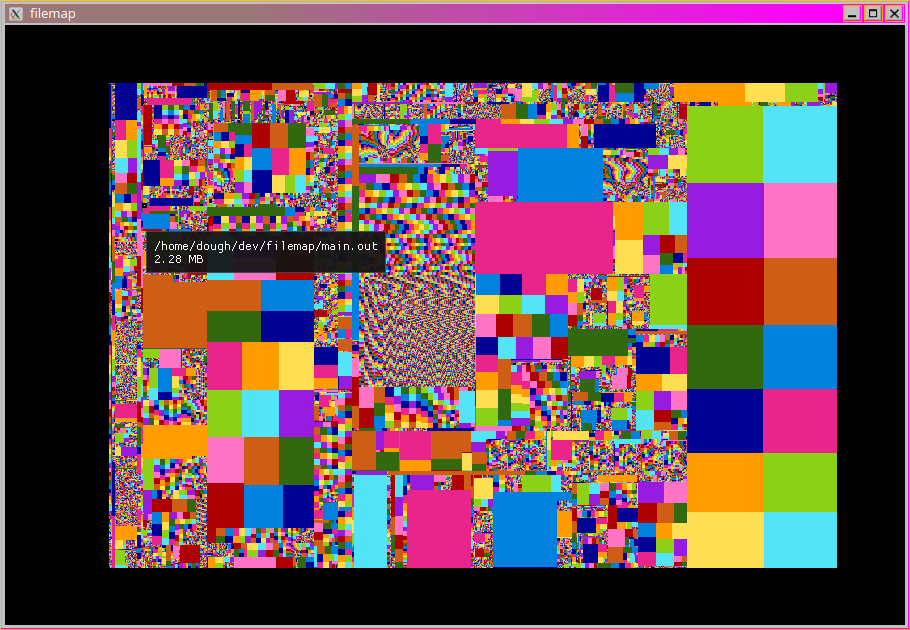

# filemap

File size visualiser using the Squarified Treemap method ([pdf](http://www.win.tue.nl/~vanwijk/stm.pdf)).

## Use
Run ./filemap [name of folder] or filemap.exe [name of folder]

Pan the map by clicking and dragging the mouse.

The name and size of the hovered-over file is displayed.

Scolling travels up the tree and displays ancestors.

Scrolling while holding down click will zoom in/out.
